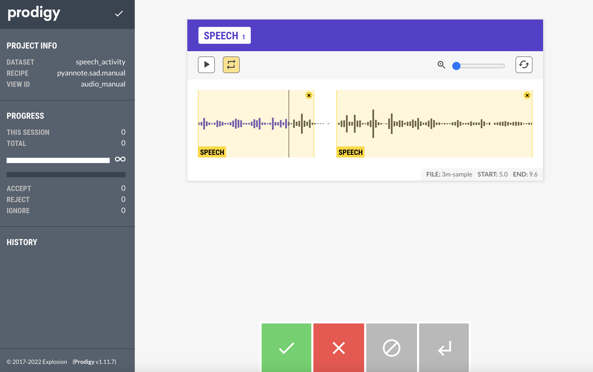

# Prodigy project pyannote labeling for CEO investor calls

This project is a template Prodigy project for using `pyannote` to have human-in-the-loop annotations of audio files.



## Installation

The installation process is automated via `make`.

```bash
# Create virtual environment (optional, recommended)
make create-venv
# Install all dependencies
make install
```

In order for the install to work, you'll need to
add a `.env` file to the root of the project that
contains your Prodigy license key. It should look
something like:

```
PRODIGY_KEY="1234-ABCD-5678-EFGH"
```

## Contents 

Currently, the project only has 1 sample `.wav` file. Soon I'll update it with additional `.wav` files.

## Usage

You can run Prodigy: 

```bash
# Run prodigy audio recipe for speech activity detection (sad)
python -m prodigy pyannote.sad.manual speech_activity ./assets/ -chunk 5
```

See the [Prodigy documentation](https://prodi.gy/docs/audio-video#pyannote-sad) for more details on this recipe.